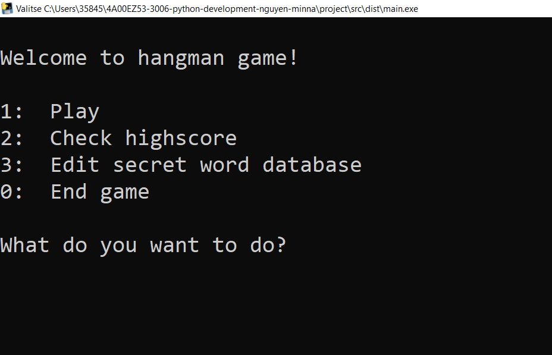
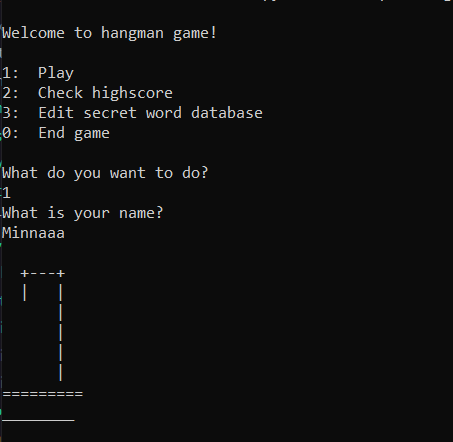
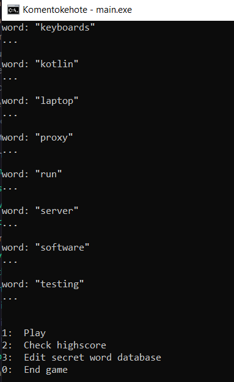

# Hangman game

This small project is about this game called hangman. Just like any hangman game, there will be a secret word that the player has to guess. The player will guess the word by inputting letters. If the player guesses the letter right, the empty line will be replaced with the player's letter. If the player guesses the letter wrong, there will be a hangman drawn. If the whole hangman is drawn, the game will end and the player loses the game. 

This is a simple game that is played on the terminal console. Since there is no frontend and backend, there won't be any RESTful API implemented. 
# Author

Minna Nguyen

# Screenshots




# Tech/framework used
This project is written using Python and its own build-in modules such as 'os' module and 'random' module.

# Installation
Double click the main.exe program to run it or on command go to .\dist root and type 'main.exe'. That will also start the app. Another option is to run the actual python file on terminal etc. python3 \src\dist\main.py.

If this app doesn't run, all the codes and files are in 'src.zip' file!

# How to Run the App

```
To run the main.py file:
python3 src\dist\main.py

In the root of src folder, to run the unittest: 
python3 -m unittest test.test_ui

Double click the main.exe in the 'dist' folder or type manually on terminal in 'dist' root: main.exe
```

# Screencast

[](https://youtu.be/xlbwmPRyWO0)
